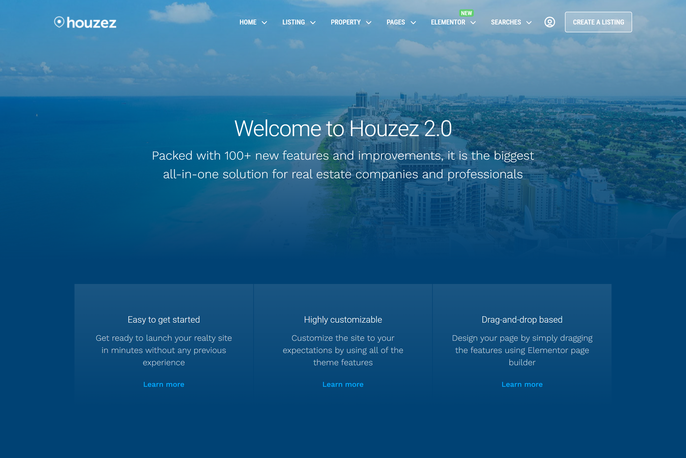

# Houzez - Real Estate WordPress Theme

The most flexible WordPress theme for real estate. Crafted for versatility. Houzez equips freelancers, realtors, and businesses with innovative tools to create a distinctive online presence. It offers easy-to-use tools that will allow you to manage your agency’s content and listings, while providing the best possible experience for your clients.

## 📌 Pages

### Active Pages

-  **Home Page**
-  **About us**
-  **Contact us**

## ⚙️ Built With

### Programming Languages

- **JavaScript:**
  High-level programming language for creating dynamic and interactive web environment.
- **HTML:**
  Markup language for defining and structuring web content.
- **CSS:**
  Stylesheet language for designing the website layout and appearance.

### Libraries

- **React:**
  JavaScript library for building user interfaces.
- **DaisyUI:**
  Component library based on Tailwind CSS for pre-designed UI elements.
- **Swiper:**
  JavaScript touch slider library to add touch-enabled and responsive sliders.
- **AOS (Animate On Scroll):**
  CSS driven scroll animation library to animate elements on scroll.
- **@vis.gl/react-google-maps:**
  JavaScript library for integrating the Google Maps JavaScript API.
- **react-router-dom:**
  Lightweight, fully-featured routing library for React.

### Bulld Tools

- **Vite:**
  Local development server for fast and efficient web development.

### Deployment

- **Netlify:**
  Development platform for deploying and hosting the website.

## 🚀 Live Demo

https://fabulous-sprinkles-90fa21.netlify.app/

## 👉 Getting Started

&nbsp;&nbsp; **1.** **Clone the repository** --> (git clone /repositoryURL/)

&nbsp;&nbsp; **2.** **Navigate to the project directory** --> (cd houzez-2.0)

&nbsp;&nbsp; **3.** **Install dependencies** --> (npm install)

&nbsp;&nbsp; **4.** **Set up environment variables** --> (Create .env file in the root directory and add VITE_GOOGLE_MAPS_API_KEY &nbsp;&nbsp;&nbsp;&nbsp;&nbsp;&nbsp;&nbsp;variable. Generate Google Maps API Key by following the instructions in this [link](https://developers.google.com/maps/documentation/javascript/get-api-key). Copy the Google Maps API Key &nbsp;&nbsp;&nbsp;&nbsp;&nbsp;&nbsp;&nbsp;and use it as value for VITE_GOOGLE_MAPS_API_KEY variable.)

&nbsp;&nbsp; **5.** **Start the development server** --> (npm run dev)

&nbsp;&nbsp; **6.** **Visit the link in your terminal** --> (CTRL + Click on http://localhost:5173)

## Author

👩🏻‍💻 Sashka Janevska

- **GitHub:** https://github.com/sashkajanevska

## Show Your Support

Give a ⭐ if you like this project!
